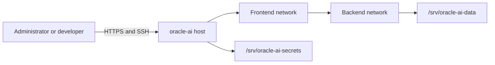
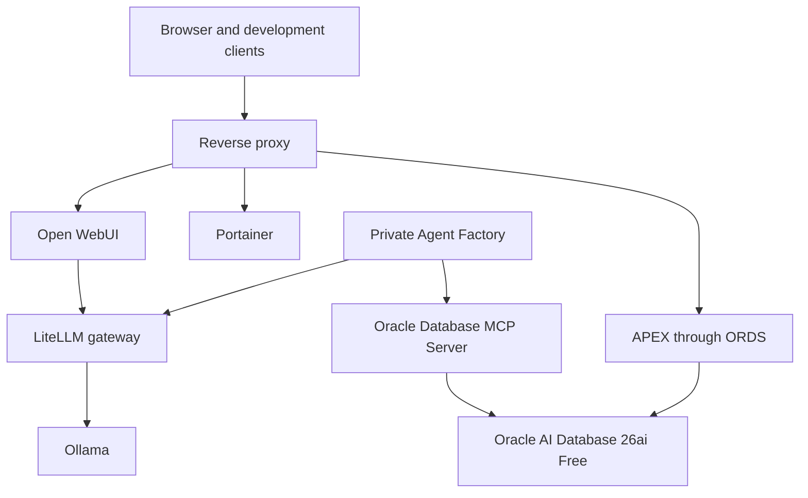

# Architecture

## Purpose

Oracle AI Data Platform is a single-host, production-inspired reference environment. It uses Docker Compose to make infrastructure definitions portable while keeping persistent state and credentials outside the Git working tree.

## Context

## Planned container topology

This diagram describes the target architecture. Version 0.1.0 does not deploy these services.

## Storage boundaries

| Path | Purpose | Git-managed | Backup policy |
| --- | --- | --- | --- |
| `/srv/oracle-ai` | Compose definitions, scripts, docs, examples | Yes | Git remote |
| `/srv/oracle-ai-data` | Database files, models, logs, backups | No | Independent data backup |
| `/srv/oracle-ai-secrets` | Passwords, API keys, wallets, certificates | No | Encrypted backup only |

## Network boundaries

- `frontend` exposes approved user-facing services through published ports or a reverse proxy.
- `backend` is an internal Docker network for databases, model runtimes, and service-to-service traffic.
- A service joins only the networks it needs.
- Database and model-runtime ports should remain LAN-only unless a documented use case requires otherwise.

## Deployment principles

1. Pin image versions rather than using floating `latest` tags.
2. Add health checks where the upstream image supports a meaningful test.
3. Use restart policies suitable for a long-running server.
4. Keep immutable configuration in Git and mutable state outside it.
5. Provide `.env.example` values without real secrets.
6. Add backup, restore, upgrade, and health-check automation alongside each operational capability.
7. Validate Compose configuration before deployment.

## Capacity profile

The initial host has 12 cores / 24 threads, approximately 28 GiB usable RAM, and approximately 937 GiB formatted NVMe capacity. Resource limits will be introduced as workloads are measured. Oracle AI Database and local models must share memory conservatively until the host is upgraded.

