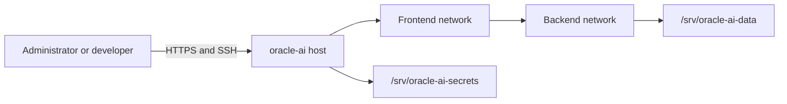
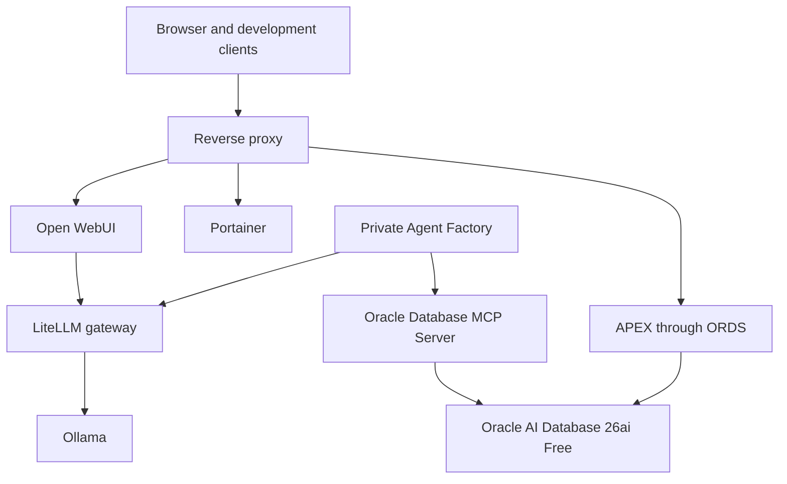

# Architecture

## Purpose

Oracle AI Data Platform is a single-host, production-inspired reference environment. It uses Docker Compose to make infrastructure definitions portable while keeping persistent state and credentials outside the Git working tree.

## Context

## Planned container topology

This diagram describes the target architecture. Version 0.2.0 deploys the Oracle database component; the remaining services are introduced incrementally.

Version 0.3.0 adds Ollama to the backend network. Its API binds to host loopback by default because Ollama does not provide native API authentication. Future containers reach it through the backend alias `ollama:11434`.

Version 0.6.0 installs APEX 26.1 into `FREEPDB1`; APEX is database metadata,
not a separate long-running container. Browser requests reach APEX through ORDS.
ORDS serves a read-only copy of matching APEX static resources under `/i/`.

## Storage boundaries

| Path | Purpose | Git-managed | Backup policy |
| --- | --- | --- | --- |
| `/srv/oracle-ai` | Compose definitions, scripts, docs, examples | Yes | Git remote |
| `/srv/oracle-ai-data` | Database files, models, logs, backups | No | Independent data backup |
| `/srv/oracle-ai-secrets` | Passwords, API keys, wallets, certificates | No | Encrypted backup only |
| `/srv/oracle-ai-work` | Verified third-party installers and disposable staging | No | Re-download from authoritative source |

## Network boundaries

- `frontend` exposes approved user-facing services through published ports or a reverse proxy.
- `backend` is a private Docker bridge network for databases, model runtimes, and service-to-service traffic. It is not marked internal because selected services publish controlled ports to the host.

Open WebUI joins both networks: `frontend` receives browser traffic on port `3000`, while `backend` reaches Ollama through the stable `ollama` network alias. Ollama remains bound to host loopback and is not exposed directly to LAN clients.
- A service joins only the networks it needs.
- Database and model-runtime ports should remain LAN-only unless a documented use case requires otherwise.

## Deployment principles

1. Pin image versions rather than using floating `latest` tags.
2. Add health checks where the upstream image supports a meaningful test.
3. Use restart policies suitable for a long-running server.
4. Keep immutable configuration in Git and mutable state outside it.
5. Provide `.env.example` values without real secrets.
6. Add backup, restore, upgrade, and health-check automation alongside each operational capability.
7. Validate Compose configuration before deployment.

## Capacity profile

The initial host has 12 cores / 24 threads, approximately 28 GiB usable RAM, and approximately 937 GiB formatted NVMe capacity. Resource limits will be introduced as workloads are measured. Oracle AI Database and local models must share memory conservatively until the host is upgraded.

For v0.2.0, the database container receives a four-CPU and 8 GiB container ceiling with 2 GiB shared memory. Oracle AI Database Free independently enforces its product resource limits.

For v0.3.0, Ollama receives an eight-CPU and 12 GiB container ceiling, one loaded model, one parallel request, and a 4096-token default context. These conservative defaults protect the 32 GB reference host while Oracle is running.

## ORDS deployment boundary

Oracle REST Data Services 26.2.0 runs on both frontend and backend networks. It exposes
HTTP port 8080 to the LAN and connects privately to `oracle-db:1521/FREEPDB1`.
Installation is isolated in a one-time Compose profile; normal runtime has no SYS secret.

## APEX deployment boundary

APEX 26.1 is installed into `FREEPDB1` using an explicit one-time SYSDBA
operation. The expanded Oracle installer remains outside Git. Dedicated
tablespaces separate platform metadata and uploaded files from `SYSAUX`.
ORDS remains the only web runtime and uses proxied PL/SQL gateway mode from
`ORDS_PUBLIC_USER` to `APEX_PUBLIC_USER`.
