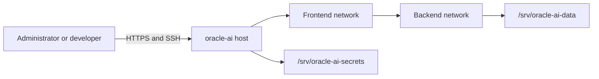
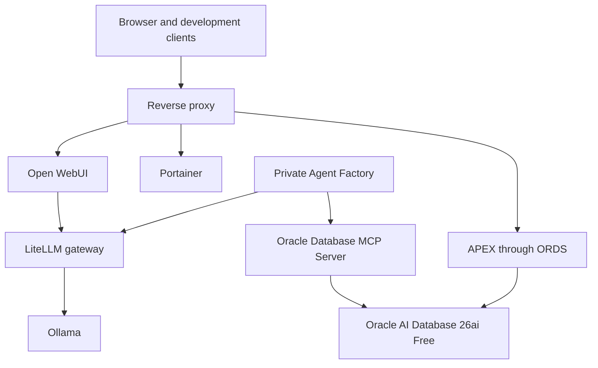

# Architecture

## Purpose

Oracle AI Data Platform is a single-host, production-inspired reference environment. It uses Docker Compose to make infrastructure definitions portable while keeping persistent state and credentials outside the Git working tree.

## Context

## Planned container topology

This diagram describes the target architecture. Version 0.2.0 deploys the Oracle database component; the remaining services are introduced incrementally.

Version 0.3.0 adds Ollama to the backend network. Its API binds to host loopback by default because Ollama does not provide native API authentication. Future containers reach it through the backend alias `ollama:11434`.

Version 0.6.0 installs APEX 26.1 into `FREEPDB1`; APEX is database metadata,
not a separate long-running container. Browser requests reach APEX through ORDS.
ORDS serves a read-only copy of matching APEX static resources under `/i/`.

Version 0.7.0 adds Oracle SQLcl 26.2 as an on-demand MCP server. An MCP client
launches the process over standard input/output; no MCP TCP port is published.
SQLcl connects to Oracle through the backend network using a dedicated
read-only database identity.

Version 0.8.0 places Private Agent Factory 26.4 in a dedicated Oracle Linux
8.10 KVM virtual machine. The Ubuntu host retains Docker and GPU ownership.
The VM reaches Oracle Database and Ollama through the private libvirt bridge;
Agent Factory is not added to the host Docker networks.

Version 0.9.0 adds a private HTTPS adaptation layer for SQLcl MCP. SQLcl
continues to run as a non-root, restriction-level-4 process. Supergateway
adapts its standard-input/standard-output transport to Streamable HTTP on the
private Docker network. Nginx terminates TLS and publishes only
`192.168.122.1:8182` to the Agent Factory VM.

Version 0.11.0 adds a coordinated operations layer. Health reporting spans the
host containers, libvirt guest, Agent Factory application, private MCP
endpoint, certificate lifetime, and filesystem capacity. Cold backups quiesce
the database and VM before copying mutable state and restore only services
that were running before the backup.

## Storage boundaries

| Path | Purpose | Git-managed | Backup policy |
| --- | --- | --- | --- |
| `/srv/oracle-ai` | Compose definitions, scripts, docs, examples | Yes | Git remote |
| `/srv/oracle-ai-data` | Database files, models, logs, backups | No | Independent data backup |
| `/srv/oracle-ai-secrets` | Passwords, API keys, wallets, certificates | No | Encrypted backup only |
| `/srv/oracle-ai-work` | Verified third-party installers and disposable staging | No | Re-download from authoritative source |
| `/srv/oracle-ai-data/vms` | Sparse VM disks for the Agent Factory boundary | No | VM-aware offline backup |
| VM `/u01/agent-factory` | Licensed kit, build workspace, temporary files, backups | No | Versioned kit and configuration backup |
| `/srv/oracle-ai-data/backups/agent-operations` | Coordinated cold backup sets and manifests | No | Retention by explicit reviewed action |

## Network boundaries

- `frontend` exposes approved user-facing services through published ports or a reverse proxy.
- `backend` is a private Docker bridge network for databases, model runtimes, and service-to-service traffic. It is not marked internal because selected services publish controlled ports to the host.

Open WebUI joins both networks: `frontend` receives browser traffic on port `3000`, while `backend` reaches Ollama through the stable `ollama` network alias. Ollama remains bound to host loopback and is not exposed directly to LAN clients.
- A service joins only the networks it needs.
- Database and model-runtime ports should remain LAN-only unless a documented use case requires otherwise.

For Agent Factory, the local `.env` overrides `OLLAMA_HOST_BIND` with
`192.168.122.1`. This publishes Ollama only on the private libvirt bridge.
The VM uses `192.168.122.202`; neither address is routed directly to LAN
clients. Browser access to Agent Factory uses an SSH tunnel until a reviewed
reverse-proxy and TLS design is introduced.

## Deployment principles

1. Pin image versions rather than using floating `latest` tags.
2. Add health checks where the upstream image supports a meaningful test.
3. Use restart policies suitable for a long-running server.
4. Keep immutable configuration in Git and mutable state outside it.
5. Provide `.env.example` values without real secrets.
6. Add backup, restore, upgrade, and health-check automation alongside each operational capability.
7. Validate Compose configuration before deployment.

## Capacity profile

The initial host has 12 cores / 24 threads, approximately 28 GiB usable RAM, and approximately 937 GiB formatted NVMe capacity. Resource limits will be introduced as workloads are measured. Oracle AI Database and local models must share memory conservatively until the host is upgraded.

For v0.2.0, the database container receives a four-CPU and 8 GiB container ceiling with 2 GiB shared memory. Oracle AI Database Free independently enforces its product resource limits.

For v0.3.0, Ollama receives an eight-CPU and 12 GiB container ceiling, one loaded model, one parallel request, and a 4096-token default context. These conservative defaults protect the 32 GB reference host while Oracle is running.

## ORDS deployment boundary

Oracle REST Data Services 26.2.0 runs on both frontend and backend networks. It exposes
HTTP port 8080 to the LAN and connects privately to `oracle-db:1521/FREEPDB1`.
Installation is isolated in a one-time Compose profile; normal runtime has no SYS secret.

## APEX deployment boundary

APEX 26.1 is installed into `FREEPDB1` using an explicit one-time SYSDBA
operation. The expanded Oracle installer remains outside Git. Dedicated
tablespaces separate platform metadata and uploaded files from `SYSAUX`.
ORDS remains the only web runtime and uses proxied PL/SQL gateway mode from
`ORDS_PUBLIC_USER` to `APEX_PUBLIC_USER`.

## MCP deployment boundary

The SQLcl MCP container runs only when invoked by an MCP client. It runs as
numeric UID:GID `54321:54321`, uses a read-only root filesystem, drops all
Linux capabilities, and has no published port. Its only persistent writable
path is `/srv/oracle-ai-data/mcp/sqlcl-home`, which contains the encrypted
SQLcl connection store.

The Agent Factory integration uses two additional containers. `mcp-http`
adapts SQLcl to Streamable HTTP without publishing its port. `mcp-tls`
terminates TLS, publishes only to the private libvirt bridge, and forwards
requests to `mcp-http` over the backend Docker network. Both use read-only
root filesystems, drop all capabilities, and disallow privilege escalation.
The TLS private key remains under `/srv/oracle-ai-secrets/mcp-tls`.

The default `ORACLE_AI_MCP` database account has `CREATE SESSION` and a
read-only role. A deliberate synchronization command grants that role `SELECT`
only on tables, views, and materialized views owned by `ORACLE_AI`. It receives
no system-catalog role, object-creation privilege, PL/SQL execution privilege,
or workspace-owner credential.

## Agent Factory deployment boundary

The `agent-factory` KVM guest runs Oracle Linux 8.10 with SELinux enforcing,
eight virtual CPUs, 12 GiB RAM, rootless Podman, and no direct GPU device.
Its 120 GiB system disk is separate from a 120 GiB sparse XFS build disk
mounted at `/u01`. The licensed Agent Factory kit is installed as the
non-root `jon` user in production mode.

The repository database remains `FREEPDB1` on the Ubuntu host. The dedicated
`AGENT_FACTORY` owner and `AAI_RO_AGENT_FACTORY` companion user are isolated
from the APEX workspace and MCP identities. Oracle's documented production
grants are broad; their use and review are explicit rather than hidden inside
the interactive installer.

## Data-agent ownership boundary

The first data-agent solution stores its versioned tables and views under the
`ORACLE_AI` application schema. Agent Factory never receives that schema's
credential. It reaches the data through SQLcl MCP as `ORACLE_AI_MCP`, whose
role receives only explicit `SELECT` grants. Dataset installation and grant
synchronization are administrative operations outside the agent runtime.

## Agent-operations boundary

Operational status is collected without modifying workloads. Storage reports
use elevated read access only where service-owned paths require it. The cold
backup command requires `--confirm`, records the initial service states, stops
ORDS before Oracle Database, shuts down the Agent Factory VM, and copies both
offline VM disks plus the database data directory. An exit trap attempts to
restore the services that were running even when a backup phase fails.

Every backup set includes a Git revision, service-state manifest, SHA-256
checksums, libvirt XML, sparse VM images, and a compressed database archive.
Retention reporting never deletes data. Restore remains a deliberate
documented operation because it replaces authoritative persistent state.
## Scheduled operations

Host systemd timers schedule daily health checks and optional weekly
coordinated backups. Health checks run as the platform owner. Backups run as a
fixed root service because VM images and database state require privileged
access. Both write to journald; failure notifications use an optional protected
webhook URL outside the repository. Retention remains report-only.

## Operations-agent data boundary

Scheduled health and backup wrappers persist bounded, structured results in
the `ORACLE_AI` schema. Host-side automation is the only writer. Agent Factory
queries that history through the existing `ORACLE_AI_MCP` read-only identity;
it receives no repository credential or write privilege. Journald and recovery
sets remain the authoritative detailed records.
